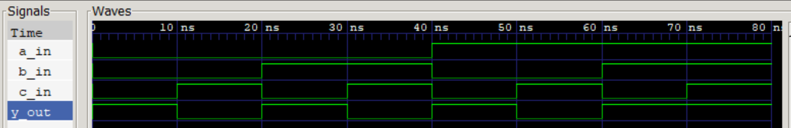

# Simple Logic Circuit (Verilog)

## Description
實現Y = (A & B) | (~C)電路


## Logic Function
Y = (A & B) | (~C)


## Truth Table
| A | B | C | Y |
|---|---|---|---|
| 0 | 0 | 0 | 1 |
| 0 | 0 | 1 | 0 |
| 0 | 1 | 0 | 1 |
| 0 | 1 | 1 | 0 |
| 1 | 0 | 0 | 1 |
| 1 | 0 | 1 | 0 |
| 1 | 1 | 0 | 1 |
| 1 | 1 | 1 | 1 |


## Simulation
- Waveform Viewer: GTKWave



## How to Run
```bash
iverilog -o output.vvp simple_logic_circuit_tb.v simple_logic_circuit.v
vvp output.vvp
gtkwave simple_logic_circuit_tb.vcd
