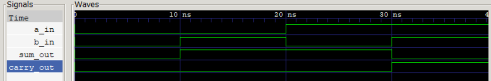

# Half Adder (Verilog)

## Description
實作出一個half Adder


## Logic Function
sum = a xor b
carry = a and b


## Truth Table
| A | B | Carry | sum |
|---|---|-------|-----|
| 0 | 0 |   0   |  0  |
| 0 | 1 |   0   |  1  |
| 1 | 0 |   0   |  1  |
| 1 | 1 |   1   |  0  |


## Simulation
- Waveform Viewer: GTKWave



## How to Run
```bash
iverilog -o output.vvp half_adder_tb.v half_adder.v
vvp output.vvp
gtkwave half_adder_tb.vcd
