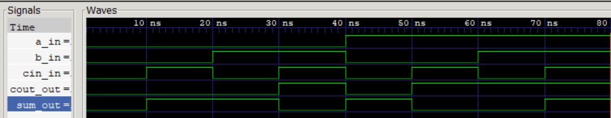

# Full Adder (Verilog)

## Description
實作出一個full Adder


## Logic Function
``` verilog
- sum = a xor b xor cin
- cout = (a and b)or(a and cin)or(b and cin)
```

## Truth Table
| A | B | Cin | Sum |Cout|
|---|---|-----|-----|----|
| 0 | 0 |   0 |  0  |  0 |
| 0 | 0 |   1 |  1  |  0 |
| 0 | 1 |   0 |  1  |  0 |
| 0 | 1 |   1 |  0  |  1 |
| 1 | 0 |   0 |  1  |  0 |
| 1 | 0 |  1  |  0  |  1 |
| 1 | 1 |  0  |  0  |  1 |
| 1 | 1 |  1  |  1  |  1 |


## Simulation
- Waveform Viewer: GTKWave



## How to Run
```bash
iverilog -o output.vvp full_adder_tb.v full_adder.v
vvp output.vvp
gtkwave full_adder_tb.vcd
